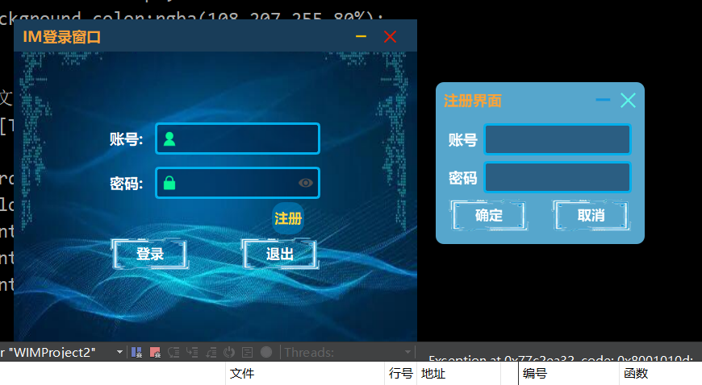
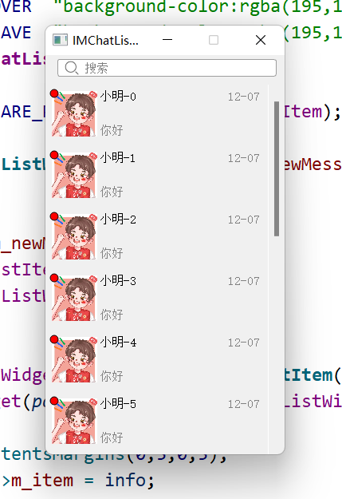
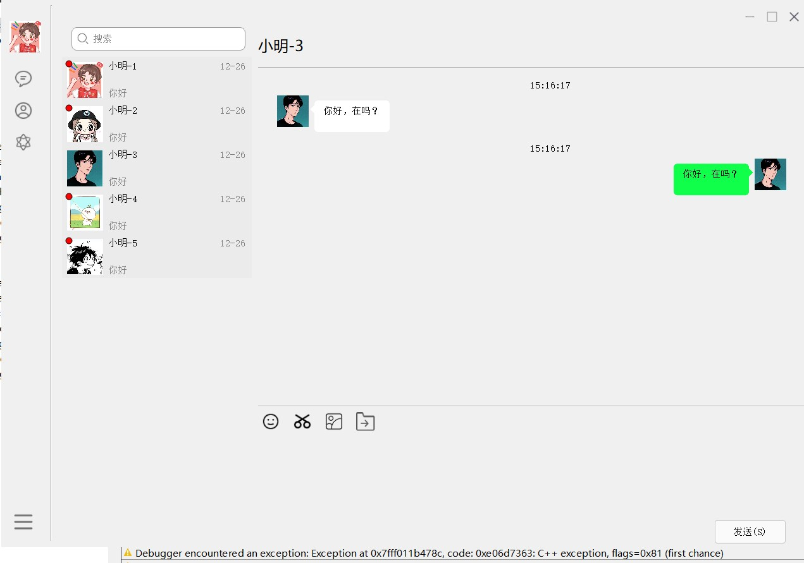
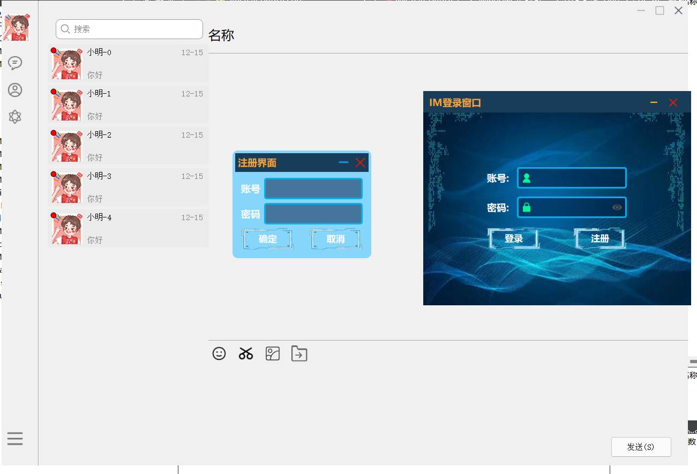
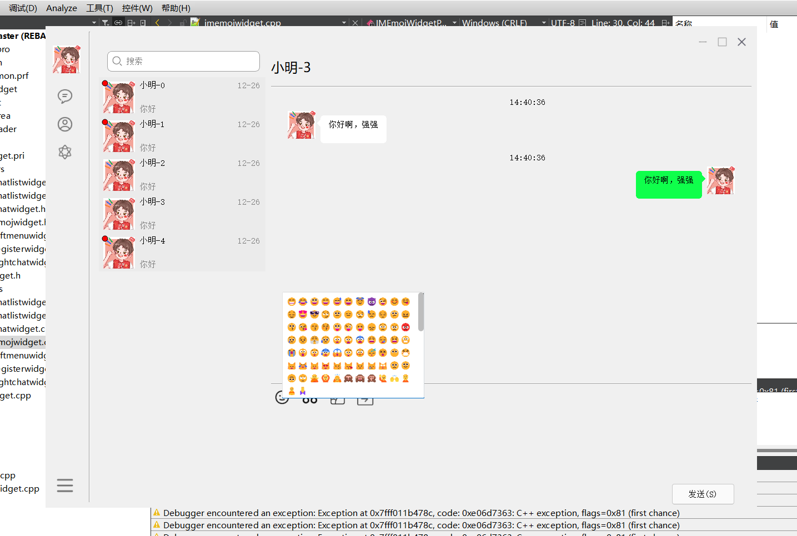

# 一 项目名称:CPPIM

###### 																																										（开发人员：yukisky）

此项目基于Qt Creator开发环境，也是为了提升工作之余对CXX以及Qt热爱编写。

大多控件都是自定义控件，支持跨平台使用。

使用spdlog日志库，支持跨平台使用。

登录窗口下图：

使用自定义标头以及控件，良好的数据库接口。

### 1.自定义窗口（主题）

### 2.自定义部分窗口界面

****

